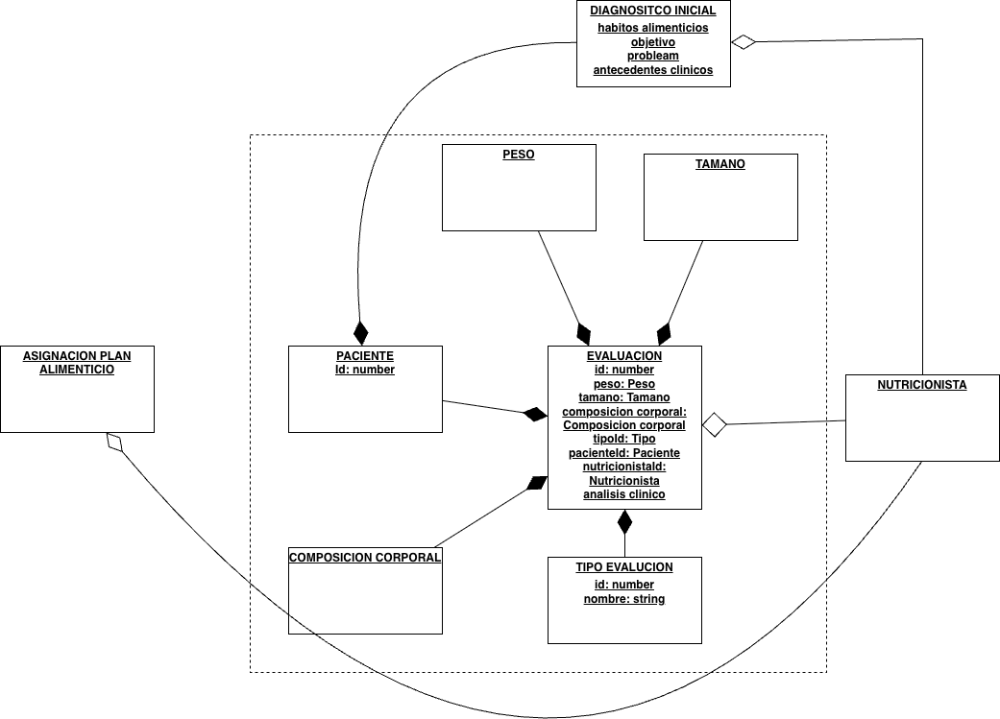

diagrama


## Healthchecks

El microservicio implementa healthchecks para garantizar que los servicios esten completamente inicializados antes de arrancar.

### Servicios con Healthcheck

| Servicio      | Healthcheck            | Descripción                                           |
| ------------- | ---------------------- | ----------------------------------------------------- |
| `zookeeper`   | `nc -z localhost 2181` | Verifica que el puerto 2181 esté accesible            |
| `kafka`       | `kafka-topics --list`  | Verifica que Kafka esté listo para recibir conexiones |
| `api-gateway` | `wget /health`         | Verifica que el endpoint de salud responda            |

### Verificar Estado

```bash
# Ver estado de todos los contenedores
docker compose ps

# Ver detalle del healthcheck
docker inspect api-gateway --format='{{json .State.Health}}' | jq
```

### Requisitos del Api-Gateway

El endpoint `/health` debe existir en api-gateway:

```typescript
@Get('health')
healthCheck() {
  return { status: 'ok' };
}
```
